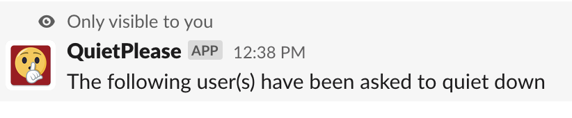

Bolt app template
=================

[QuietPlease]() is a Slack app that allows you to anonymously ask other users to quiet down in your general channel

ScreenShots
------------

* Start by typing in the slash command `/quietdown @user`

* You should then recieve some feedback that your command was successfully executed

* This is what the users of the workspace will see in the general channel

